ERD Online操作指引! 🔥🎶

### 一、新增项目

登录到系统之后，首页会显示所有项目信息

点击第一个块，新增一个项目

点击确认，这样就有了第一个项目了

每个项目下放有两个操作，编辑 和 删除，用于修改项目的基本信息，或者删除当前项目

### 二、新增模块
我们用上面新建的项目，演示新增模块，新增模块有两种方式，一：手动增加模块，二：从数据库逆向解析生成模块

手动增加模块

点击上面新增的项目，进入到设计页面

点击无模块点击新增

录入模块信息，模块名为业务中的英文字符，中文名称为模块中文解释

点击确定，这样就建好了自己的第一个模块，新建的模块中还没有任何业务表，以后章节我们会讲如何新增表

从数据库逆向解析生成模块

我们接上一节，演示如何逆向解析

首先，从数据库逆向解析需要配置数据库，点击右上角闪电图标，弹出数据库配置窗口

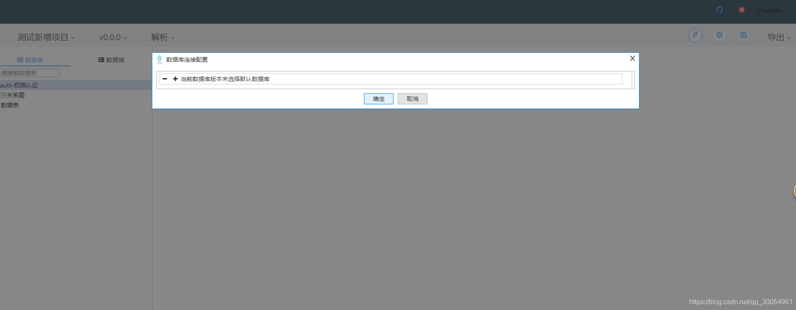

点击＋ 配置一个数据库连接，目前为止，支持 MYSQL、ORACLE、SQLSERVER、DB2(需要开启 oracle 兼容模式)、POSTGRESQL

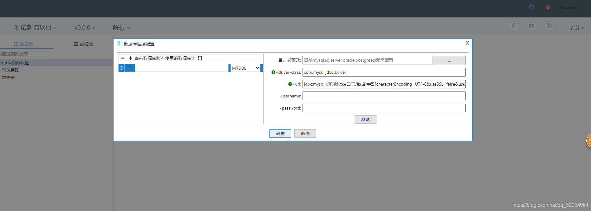

录入数据库配置信息

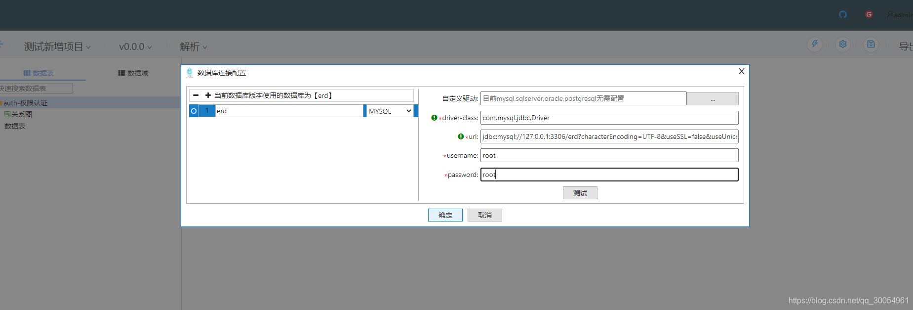

点击测试连接，出现连接成功，说明该数据库连接配置没为题，然后点击确定，保存该配置

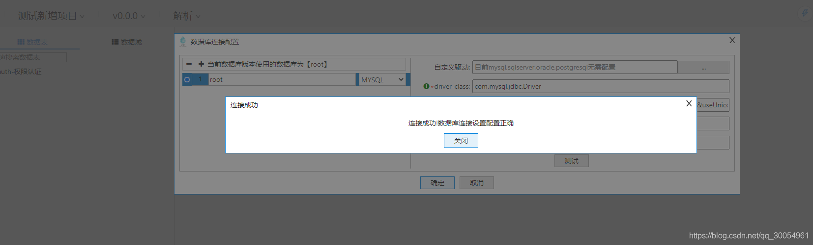

点击解析

选择数据库逆向解析，弹出配置框

数据库选择刚才新增的数据库root，逻辑名格式选择不处理，点击下一步

选中需要逆向解析的表，点确认

这样在左侧，就会自动生成选中的表模型记录

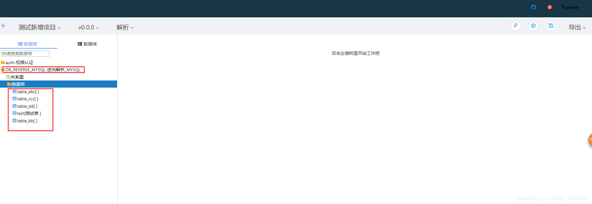

### 三、新增表

右键选择每个模块的数据表，选择新增数据表

输入表的英文名称

点击确认，在模块下就有了新增的表。双击数据表，再双击table_ddd就可以开始设计表了

录入表中文名

点击右上角保存

到这里，我们的第一个表就建好了

###四、表设计

基本信息

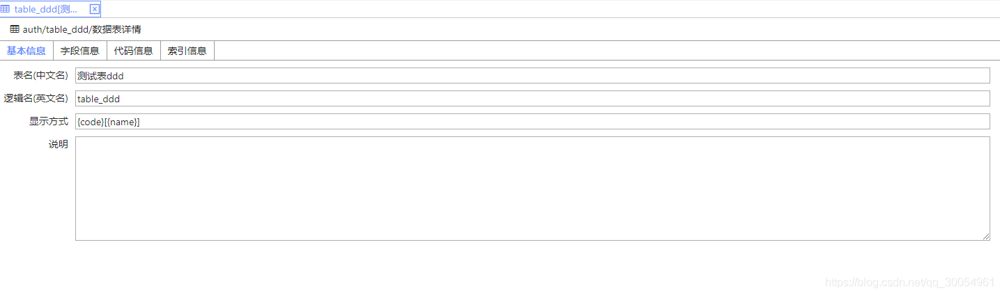

字段信息

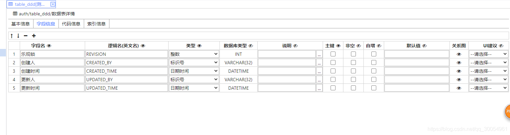

代码信息

MYSQL

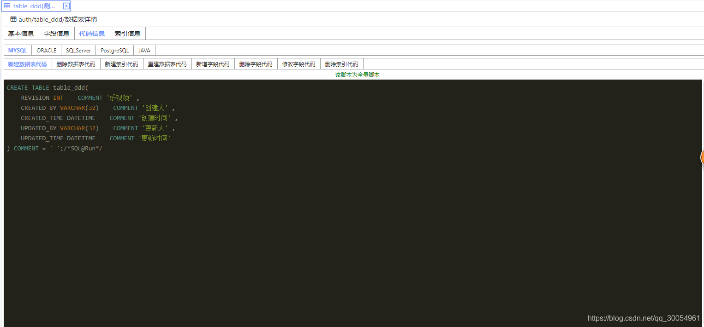

ORACLE(DB2)

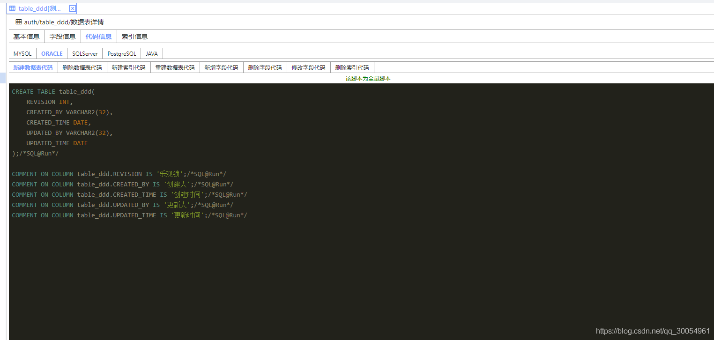

SQLSERVER

POSTGRESQL

JAVA

索引信息

### 五、表设计快捷操作

每个表都提供复制,粘贴,剪切,删除,重命名 五个快捷键

### 六、版本管理

为方便记录、比对版本，特提供版本管理功能，可以记录每个版本做了什么改动，以及比对两个版本之间的差异项

同步配置

重新建表

每次变动，都会删除原表，重新建表，谨慎使用该模式，默认是重新建表

字段增量

每次变动，只记录字段的增减改动信息，并生成 sql 脚本，推荐使用该模式

初始化基线

第一次新建项目后，默认版本为 V0.0.0，此版本为系统默认生成的，没有任何实际意义，需要初始化基线，将刚才新增的东西做一个版本分割

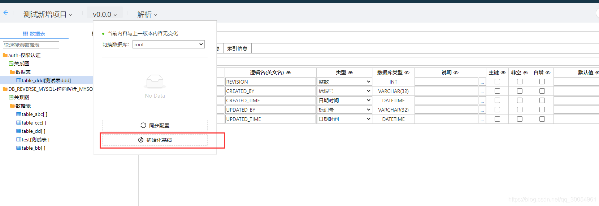

点击初始化配基线 ，输入版本号V1.0.0 ，描述初始化基线

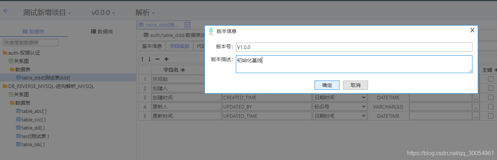

点击确认，这样就有了我们的第一个版本

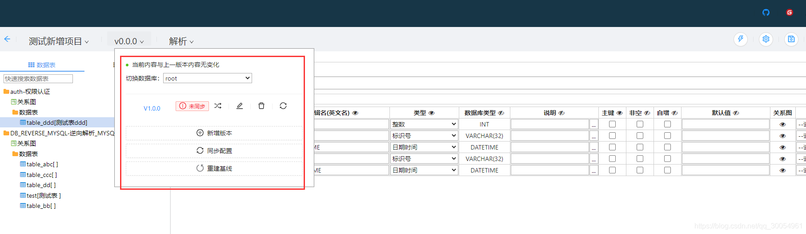

接下来，看看这个版本有哪些变动，点击蓝色的V1.0.0

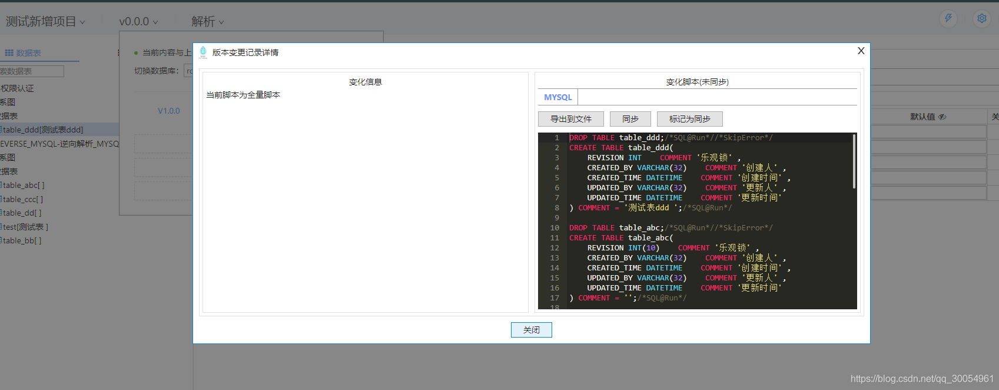

此时的改动，都还未往数据库同步，点击右边的同步，可以将改动同步到数据库，同步成功后，如图所示

	注：这里的操作会先执行删表操作，在执行建表，如果是数据库逆向的表，要注意数据库表中数据，别面误删除	

再看V1.0.0版本，已经为已同步状态

新增版本

接下来我们看看新增字段，自动生成的脚本

在 table_ddd 表中新加一个字段，完了点右上角点保存

刷新页面，可以看到版本现在提示有变动，未保存新版本

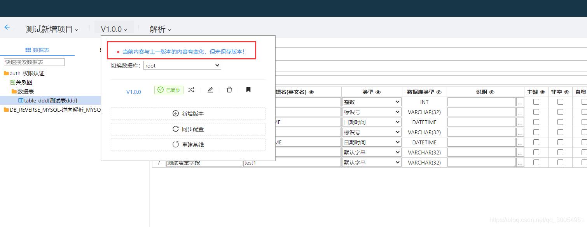

点击这行蓝字，可以看到，已经自动生成了 sql 脚本，提供导出到本地的功能

关闭弹窗，点击新增版本，将这个改动保存为新版本

再看版本列表，已经有了

点击蓝字V1.0.1，可以看到改动 sql，点击同步，即可将改动同步到数据库

此时，新增的两个版本，都已经同步到数据库了

### 七、导出

导出文档

导出 html

导出 md

导出 DDL

导出 JSON

### 八、配置

配置默认数据

点击右上角设置

弹出默认设置

### 九、系统设置

点击右上角系统设置

即可对系统用户、角色、权限进行编辑

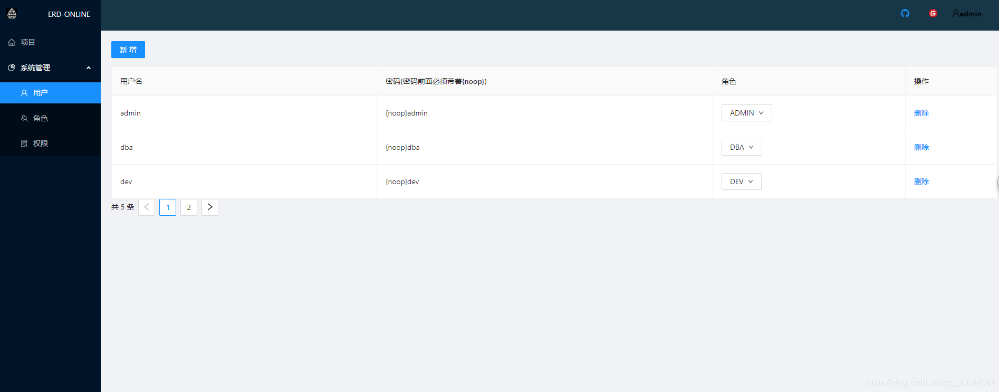

