ERD Online操作指引! 🔥🎶

### 一、新增项目

扫码登录到系统之后，首页会显示所有项目信息


点击第一个块，新增一个项目


点击确认，这样就有了第一个项目了


### 二、新增模块
我们用上面新建的项目，演示新增模块，新增模块有两种方式，一：手动增加模块，二：从数据库逆向解析生成模块

手动增加模块

点击上面新增的项目，进入到设计页面

点击无模块点击新增


录入模块信息，模块名为业务中的英文字符，中文名称为模块中文解释


点击确定，这样就建好了自己的第一个模块，新建的模块中还没有任何业务表，以后章节我们会讲如何新增表


从数据库逆向解析生成模块

我们接上一节，演示如何逆向解析

首先，从数据库逆向解析需要配置数据库，点击右上角闪电图标，弹出数据库配置窗口


点击＋ 配置一个数据库连接，目前为止，支持 MYSQL、ORACLE、SQLSERVER、DB2(需要开启 oracle 兼容模式)、POSTGRESQL


录入数据库配置信息


点击测试连接，出现连接成功，说明该数据库连接配置没为题，然后点击确定，保存该配置


点击解析


选择数据库逆向解析，弹出配置框

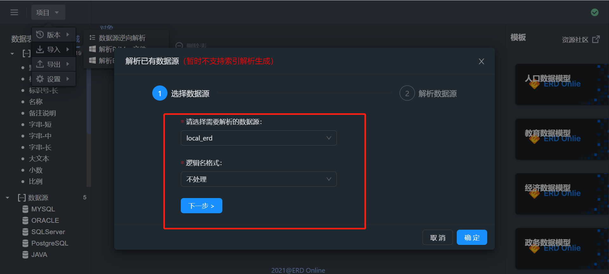

数据库选择刚才新增的数据库local_erd，逻辑名格式选择不处理，点击下一步


选中需要逆向解析的表，点确认


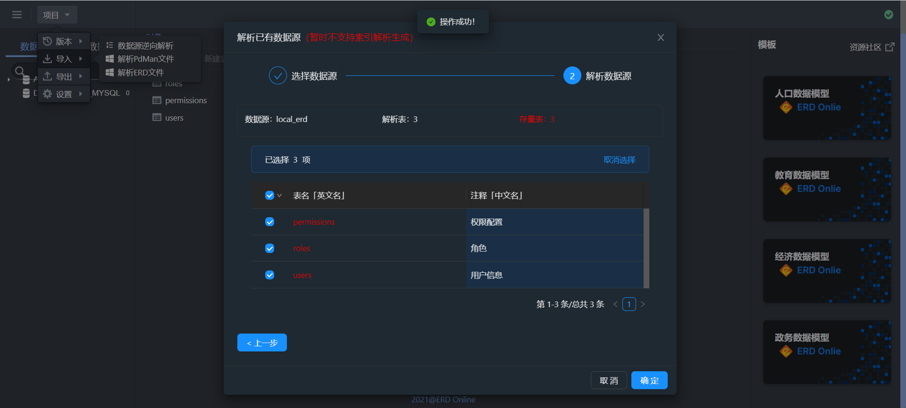

这样在左侧，就会自动生成选中的表模型记录


### 三、新增表

右键选择每个模块的数据表，选择新增数据表，输入表的英文名称


点击确认，在模块下就有了新增的表。双击右侧数据表，再双击table_ddd就可以开始设计表了

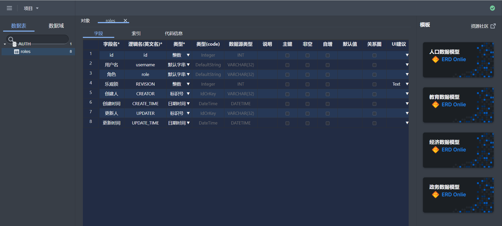

PS:设计表自动保存

右键字段右上角，可以插入行、复制、剪切、对齐等操作

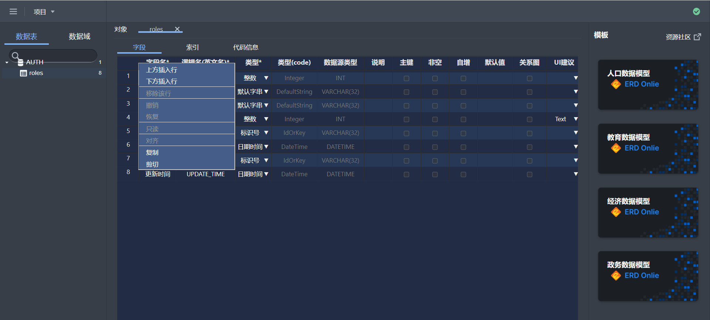

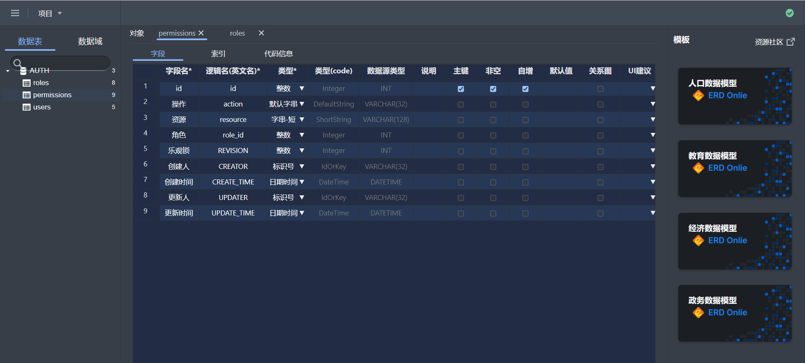

到这里，我们的第一个表就建好了

###四、表设计

基本信息


代码信息

MYSQL

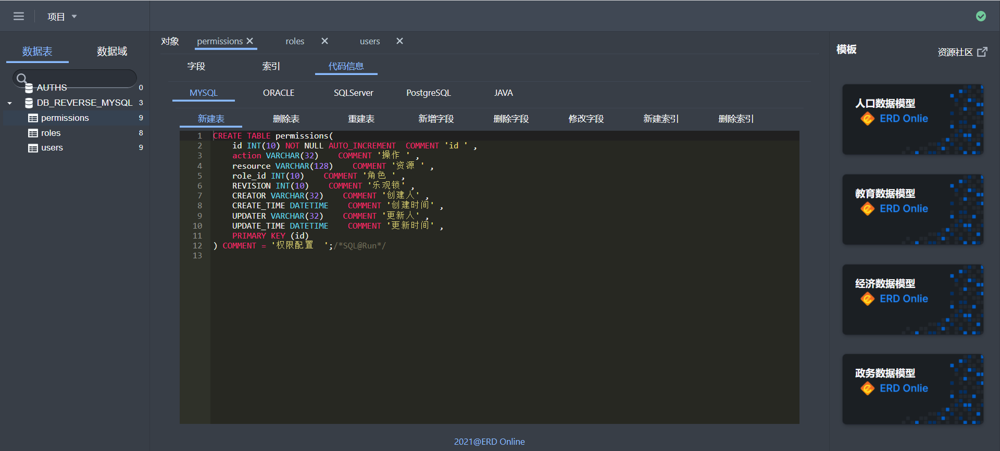

ORACLE(DB2)


SQLSERVER


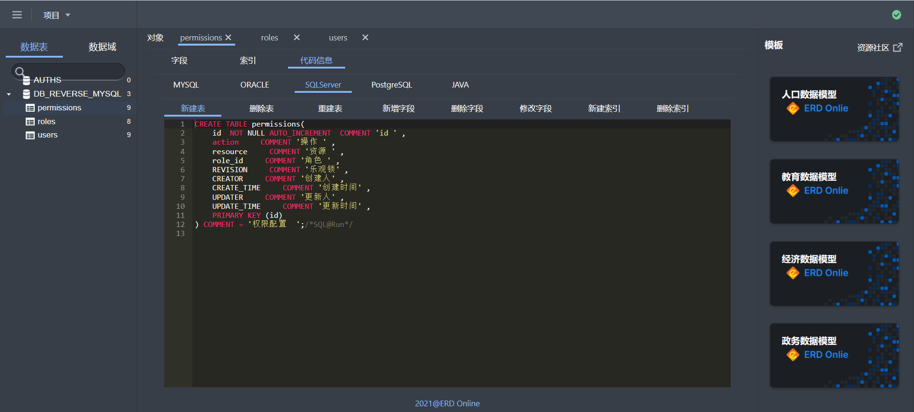

POSTGRESQL


索引信息


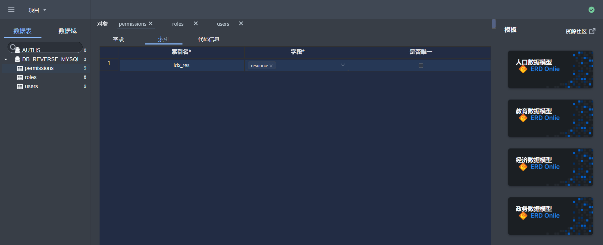


### 五、表设计快捷操作

每个表都提供重命名、删除快捷键，对表进行右键显示


### 六、版本管理

为方便记录、比对版本，特提供版本管理功能，可以记录每个版本做了什么改动，以及比对两个版本之间的差异项


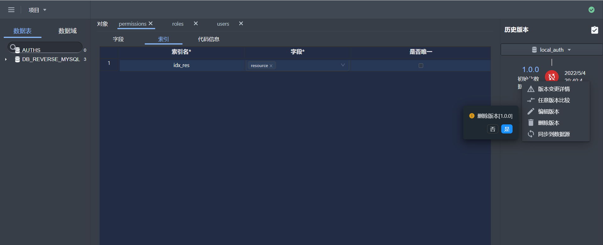


同步配置


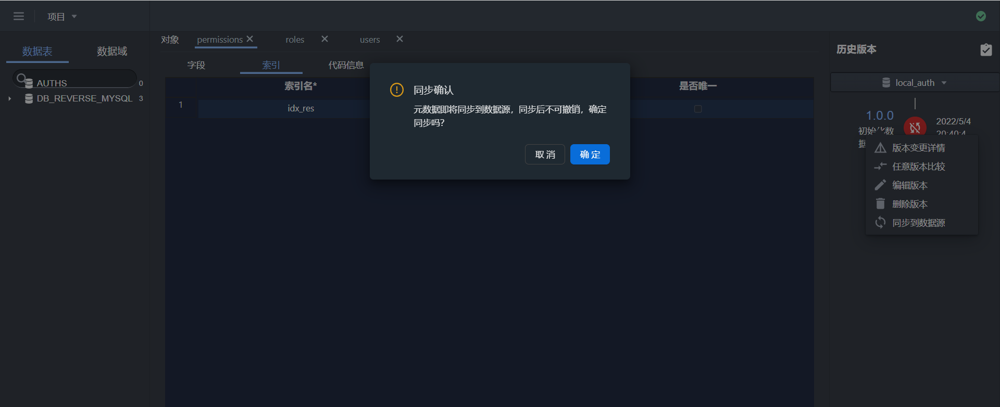

重新建表

每次变动，都会删除原表，重新建表，谨慎使用该模式，默认是重新建表

字段增量

每次变动，只记录字段的增减改动信息，并生成 sql 脚本，推荐使用该模式

初始化基线

第一次新建项目后，默认版本为 V0.0.0，此版本为系统默认生成的，没有任何实际意义，需要初始化基线，将刚才新增的东西做一个版本分割


点击初始化配基线 ，输入版本号V1.0.0 ，描述初始化基线


点击确认，这样就有了我们的第一个版本


右边框会显示一个版本信息
点击右键显示：
        版本变更详情：可以看到版本变更详细信息和映射的变更语句
        任意版本比较：如果存在多个版本，可以对变更进行比较，并且显示
        编辑版本
        删除版本
        同步到数据源：可以直接把本次变更执行同步到对应的数据源（前提是前一个版本已经同步）

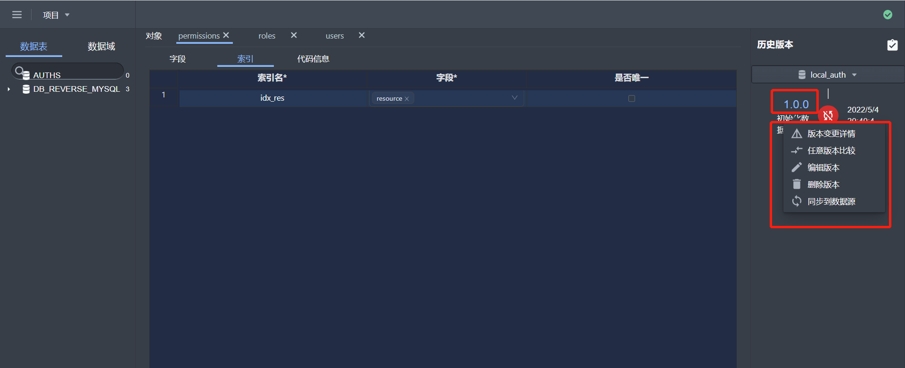

版本变更详情


任意版本比较


编辑版本

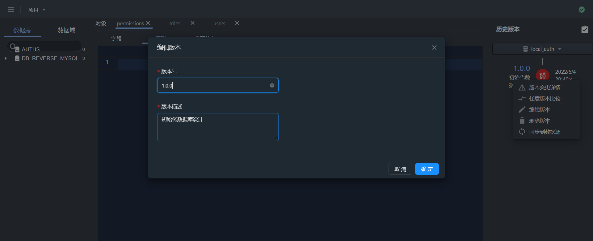

删除版本


同步到数据源


接下来，看看这个版本有哪些变动，点击蓝色的V1.0.0


此时的改动，都还未往数据库同步，点击右边的同步，可以将改动同步到数据库，同步成功后，如图所示

	注：这里的操作会先执行删表操作，在执行建表，如果是数据库逆向的表，要注意数据库表中数据，别面误删除	

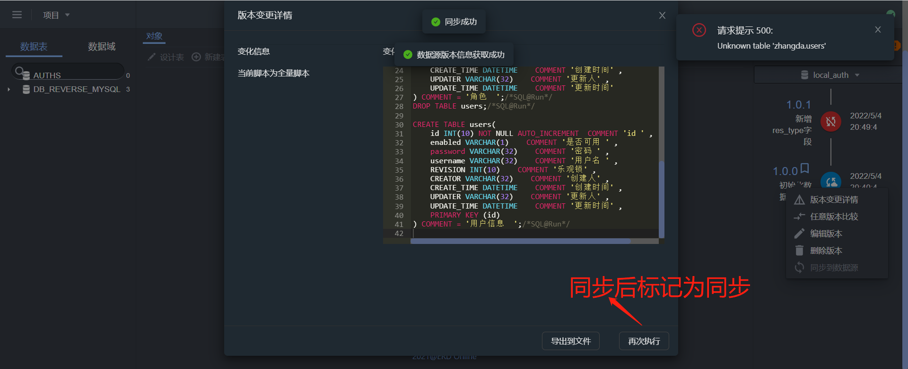


再看V1.0.0版本，已经为已同步状态


新增版本

接下来我们看看新增字段，自动生成的脚本

在 permissions 表中新加一个字段


关闭弹窗，点击新增版本，将这个改动保存为新版本


右边刷新，显示一个新的版本1.0.1
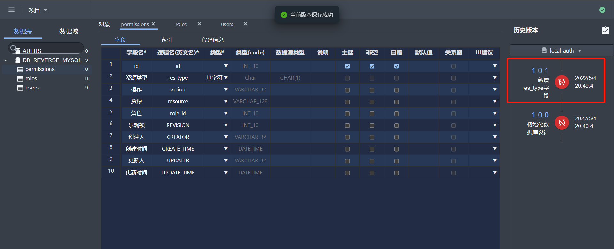

版本比对

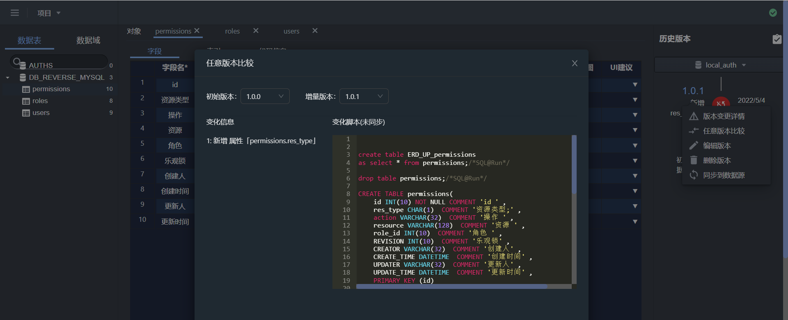

点击蓝字V1.0.1，可以看到改动 sql，点击同步，即可将改动同步到数据库

如果1.0.0版本未同步，则会给出提示

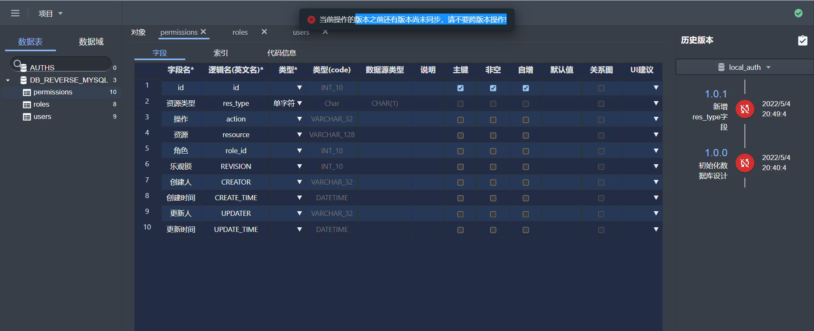

先执行同步1.0.0版本然后再操作1.0.1版本


此时，新增的两个版本，都已经同步到数据库了


这里同步到数据源的按钮变灰色了

### 七、导出

可以导出格式为：HTML\word\Markdown\DDL\ERD文件


导出word文档


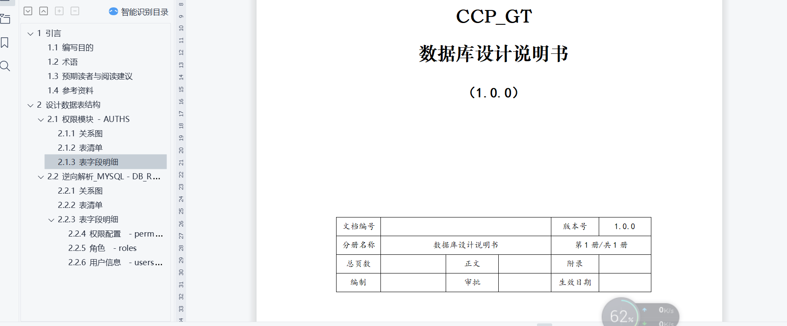

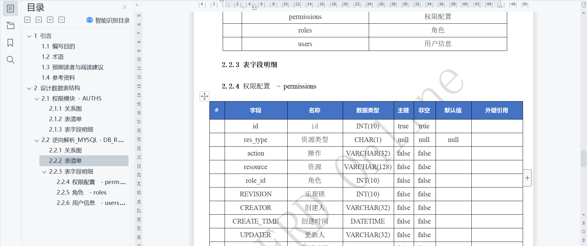

导出 html


导出 md


导出 DDL

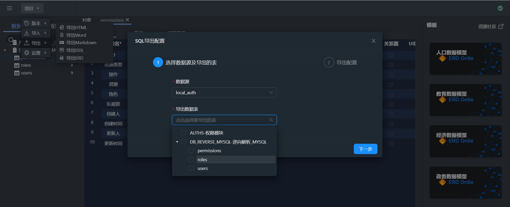

可以选择哪张表

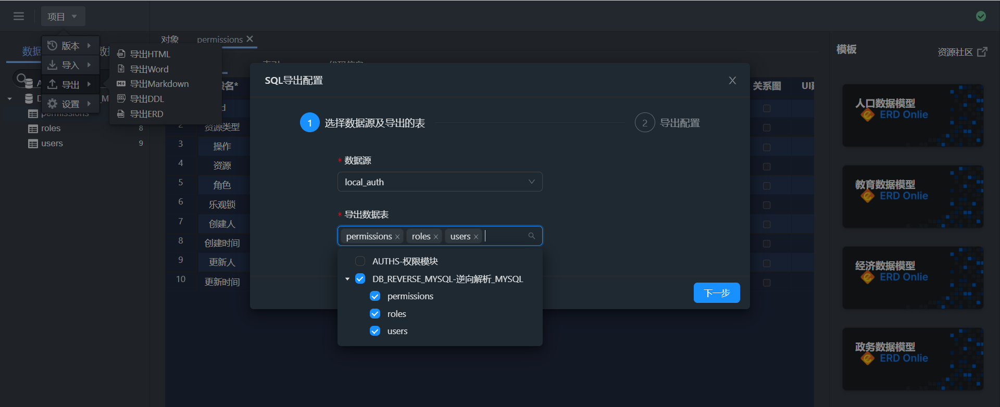

预览


导出 ERD 文件（加密导出erd上的元数据，导出之后，可以导入到任何erd系统中）

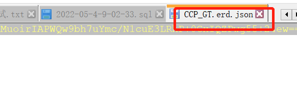

可以在这里解析导出的ERD文件


### 八、配置

配置数据库

点击左上角设置，新增数据源，测试，确认

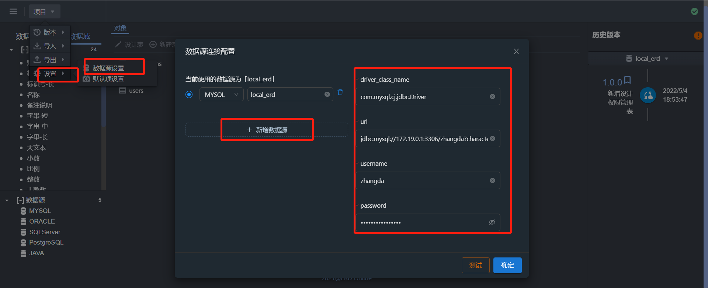

配置数据表默认字段（每张表的共有字段）


配置ERD的默认配置


### 九、数据域配置

这个功能可以帮你定义业务领域的数据词典

左上角点击数据域tab


定义好业务领域的数据域的数据词典: 名称、代码、字段类型


设计表时可以选择这个业务领域的字段即可


```js
这样大家都遵照规范词典进行数据库设计;
```

### 更多功能敬请期待，你也可以在我们的论坛跟我们说出你们的想法和提出宝贵意见....


