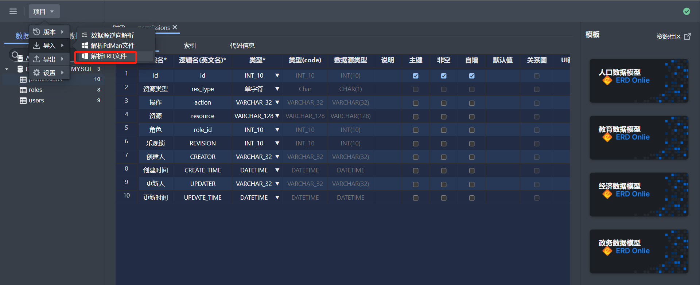
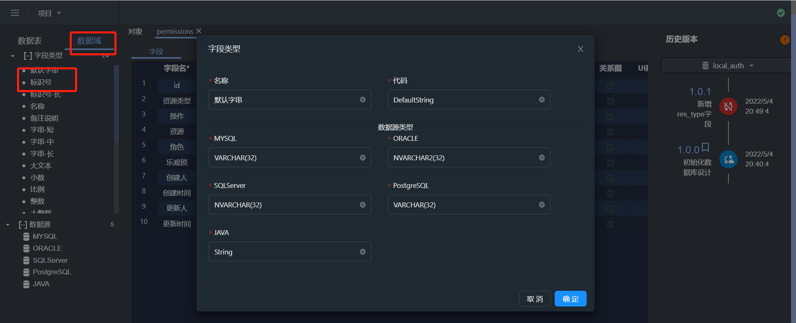
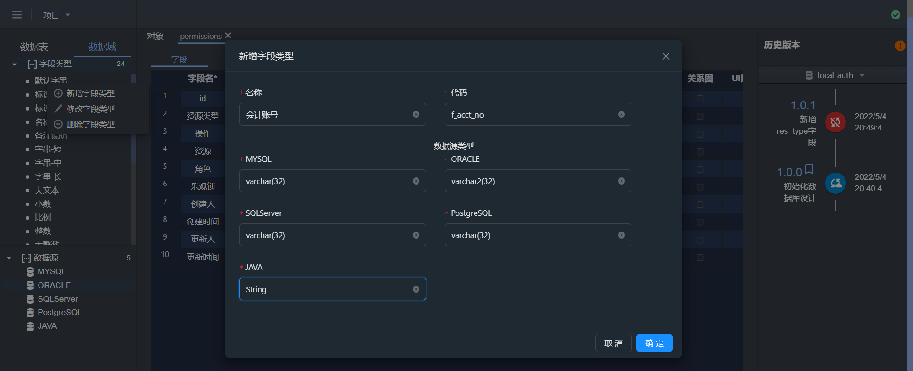
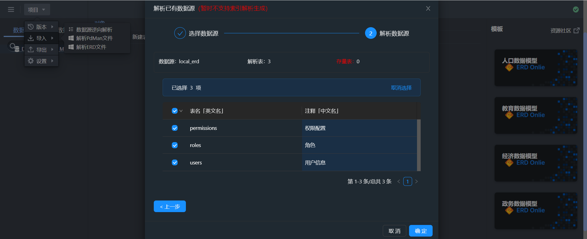

## ERD Online可以帮你做...

📦 开箱即用，将注意力集中在数据结构设计上

📋 快速复制已有表结构、json 生成表

🏷 在线管理表结构，支持正向向数据库执行

🎨 将已有的数据库结构解析到软件中管理

📱 支持多种数据库连接在线管理（Mysql、Oracle、DB2、SqlServer、PostGreSql）

📡 每个需求与变动，都可以生成版本，每个版本之间可以比对差异

🎉 可将所有表结构，自动生成 word、html、md 文档，便于线下流动

## 甚至可以帮你定义业务领域的数据词典....

### 第一步定义数据域:

定义好业务领域的数据域的数据词典:
名称、代码、字段类型







### 第二步设计数据表:

设计数据库表，选择第一步添加的数据词典



```js
这样大家都遵照规范词典进行数据库设计;
```

```js


### 另外还可为每个表设计默认数据字段:

入口和操作


```js
作用：每次新增表都有默认字段，数据治理非常有用...
```

### 更多功能等你解锁使用....