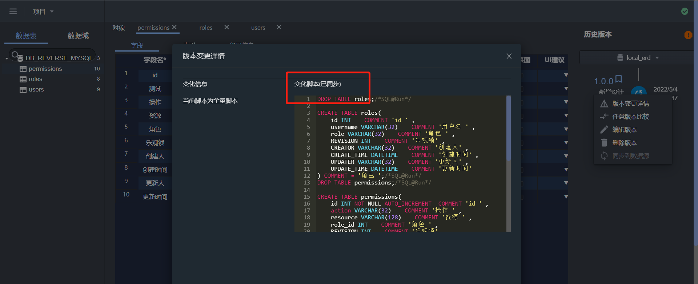
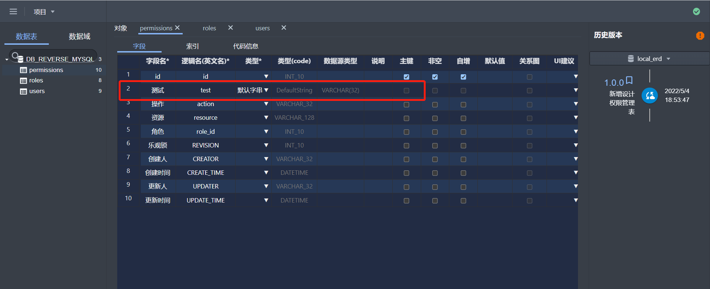
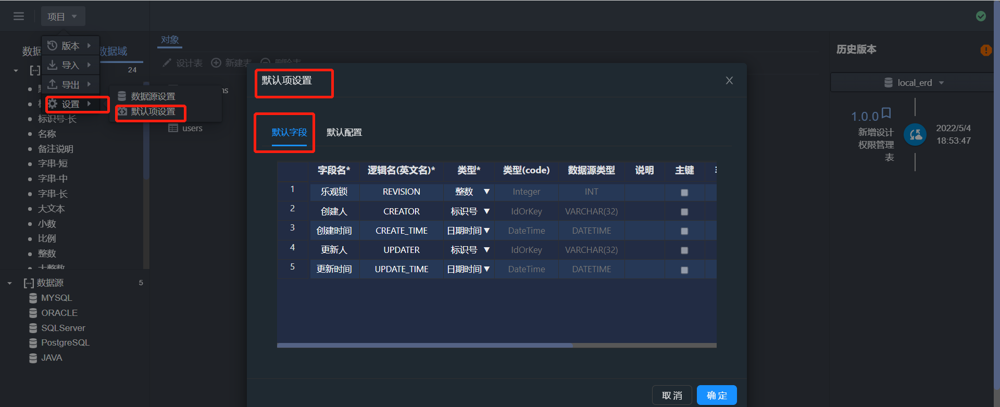
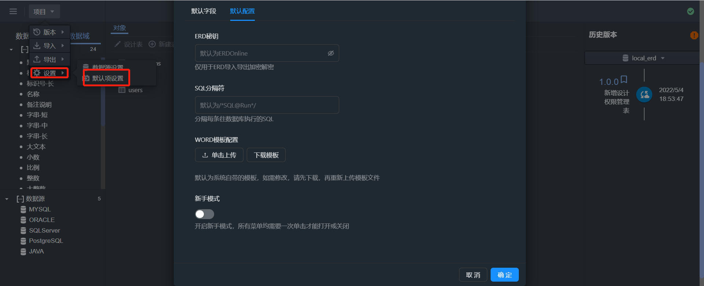

代码仓库


	Github : https://github.com/whaty/MARTIN-ERD.git
	Gitee: https://gitee.com/MARTIN-88/erd-online.git

推荐使用yarn安装

安装依赖

```yarn
install
```

运行

```yarn
start
```

打包

Windows

```yarn
package-win
```

MAC

```yarn
package-mac
```

Linux


```yarn
package-linux
```


如果不想使用yarn 可以直接用npm的方式:

首先安装nodejs[不知道的请自行百度]

然后配置npm依赖库淘宝镜像[不知道的请自行百度]


接着安装本地npm依赖库



安装完毕后启动

```npm
run start
```



本地打包

```npm
run build
```


把build目录下的包放在服务器nginx上配置，既可以访问

PS:
注意配置后端服务地址



